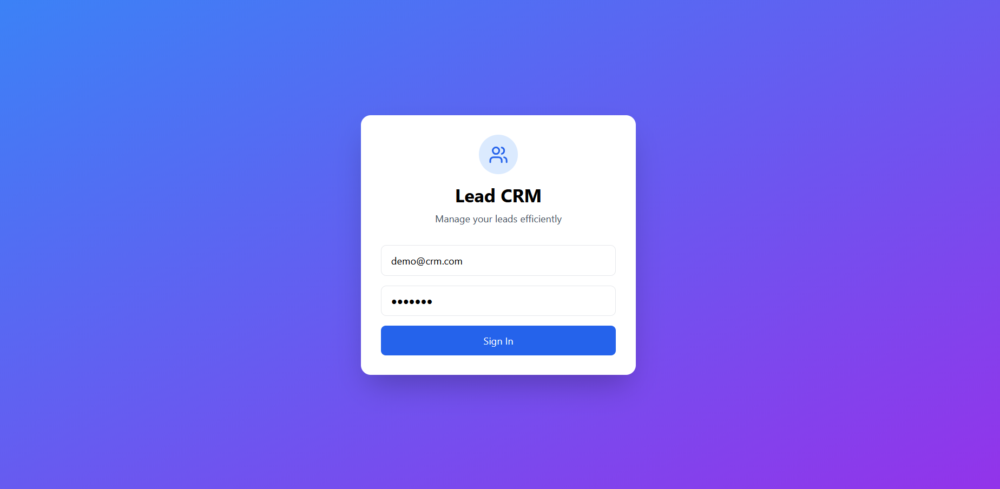
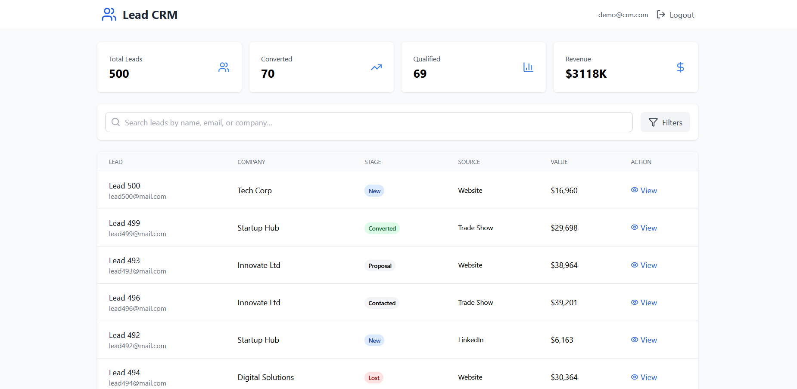
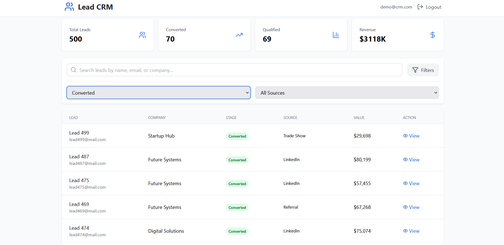
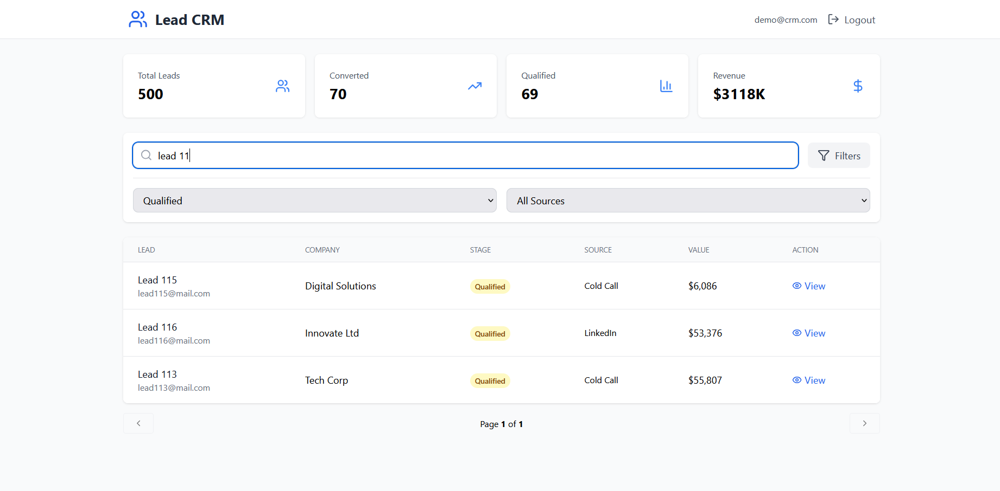
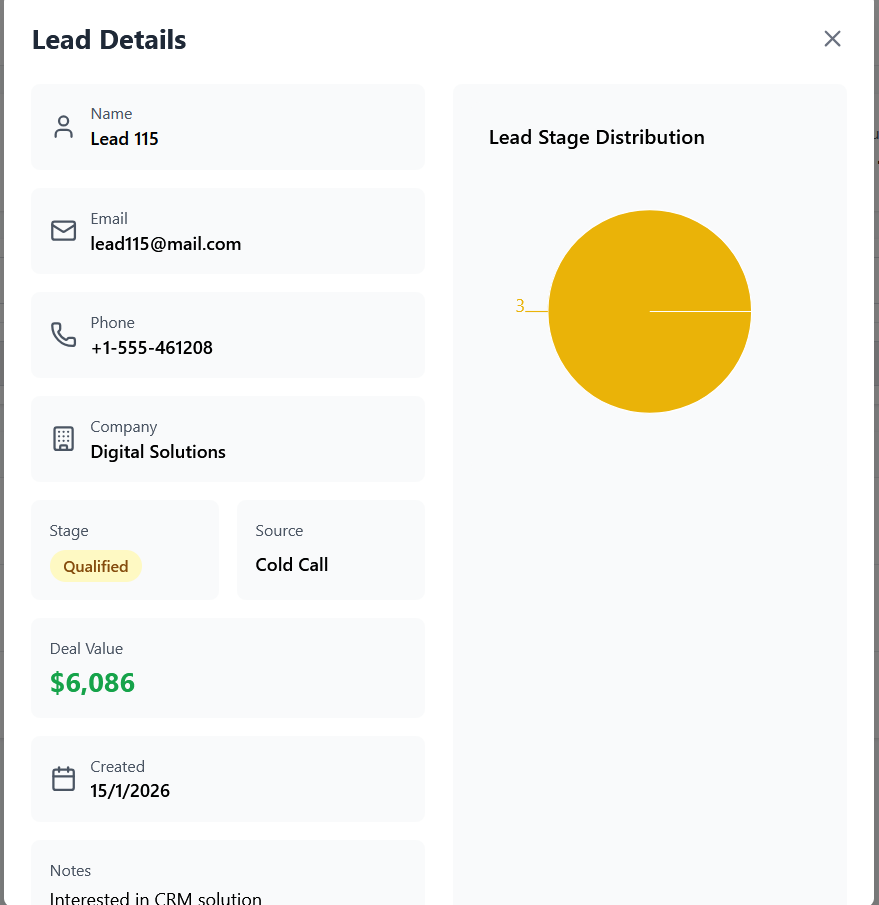
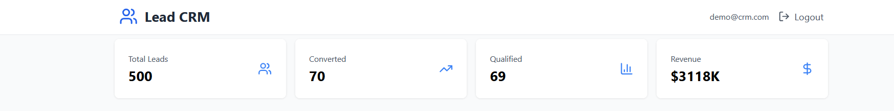

# Mini CRM Dashboard

A full-stack Mini CRM application built using React, Node.js, Express, and MongoDB.  
This project demonstrates lead management, analytics, and server-side data handling using a real-world CRM use case.

---

## 🚀 Features

### 🔐 Authentication
- Simple login screen with demo credentials
- Secure access to the dashboard

### 📋 Lead Management
- Display leads in a responsive table
- Server-side pagination
- Search leads by name, email, or company
- Filter leads by stage and source
- Sort leads by date or value

### 📊 Analytics
- Total number of leads
- Number of converted leads
- Number of qualified leads
- Lead distribution by stage (chart)

### 👁 Lead Details
- View detailed lead information in a modal
- Includes contact details, company, stage, source, deal value, and notes
- Visual chart for lead stage distribution

---

## 🧠 Tech Stack

### Frontend
- React
- Tailwind CSS
- Recharts
- Lucide Icons

### Backend
- Node.js
- Express.js
- MongoDB Atlas (Free Tier)
- Mongoose

---

## 🗄 Database
- MongoDB Atlas (Free Tier)
- Database connection handled via environment variables
- Automatically seeds 300–1,000 dummy leads if the database is empty

---

## 🔌 API Endpoints

### Get all leads (search, filter, pagination)

**Query Parameters**
- `page`
- `limit`
- `search`
- `stage`
- `source`
- `sortField`
- `sortOrder`

---

### Get single lead

---

## 🌱 Dummy Data Seeding
- Automatically seeds 500 leads on first run
- Prevents duplicate seeding
- Includes multiple stages, sources, companies, and deal values

---

## 📱 Responsive Design
- Fully responsive UI
- Optimized for mobile, tablet, and desktop devices

---

## ▶️ How to Run Locally

### Backend
```bash
npm install
npm start

### .env
MONGODB_URI=your_mongodb_connection_string
PORT=5000

### Frontend
npm install
npm run dev

📌 Demo Credentials
Email: demo@crm.com
Password: demo123

---

# 📸 SCREENSHOTS + CAPTIONS (For Submission)

Use these **exact screenshots** and captions in your assignment PDF / portal.

---

### 📷 Screenshot 1: Login Screen
**Caption:**  
> Login screen allowing users to access the CRM dashboard using demo credentials.

---

### 📷 Screenshot 2: Dashboard Overview
**Caption:**  
> Main dashboard displaying analytics metrics such as total leads, converted leads, qualified leads, and revenue.

---

### 📷 Screenshot 3: Search & Filters
**Caption:**  
> Search and filter functionality enabling users to quickly find leads by name, stage, or source.

---

### 📷 Screenshot 4: Leads Table with Pagination
**Caption:**  
> Paginated leads table showing lead details with server-side pagination for scalable data handling.

---

### 📷 Screenshot 5: Lead Details Modal
**Caption:**  
> Detailed lead view modal displaying contact information, deal value, notes, and lead stage.

---

### 📷 Screenshot 6: Analytics Chart
**Caption:**  
> Visual representation of lead distribution by stage using interactive charts.


Created by Latish Salunkhe